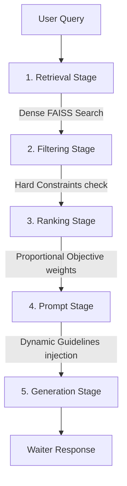
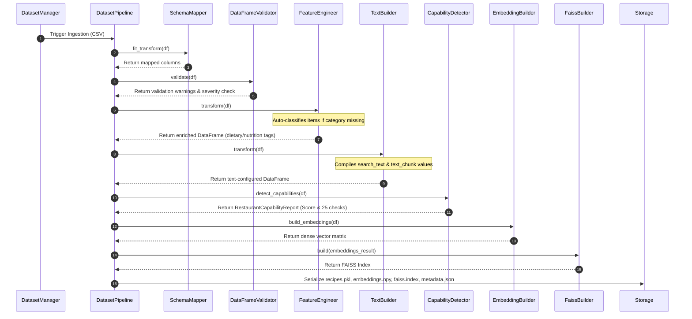
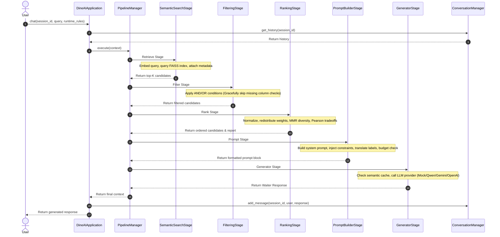

# DineAI Menu Intelligence & Recommendation Framework

Welcome to the **DineAI** project documentation. This document provides an exhaustive, end-to-end breakdown of the framework's architecture, design patterns, internal modules, and structural workflows.

DineAI is an enterprise-grade, semantic search and LLM-powered restaurant assistant designed to ingest raw restaurant menus, normalize and enrich them with dietary/nutritional features, index them vectorially, and serve highly personalized, capability-aware chat recommendations.

---

## 1. Project Directory Map

The framework is organized into decoupled modules following **Clean Architecture** principles, separating adapters, database lifecycle, vector operations, retrieval stages, and generation.

```text
d:\data\AI_WAITER\
├── PLANS/                                  # Design roadmaps, component walkthroughs, and logs
├── translations/                           # Localization files for multi-lingual waiter persona
│   ├── en.json                             # English translations catalog
│   ├── ar.json                             # Arabic translations catalog
│   └── fr.json                             # French translations catalog
│
├── dine_ai/                                # Root Python package
│   ├── app.py                              # Main Orchestrator Facade & Interactive CLI
│   │
│   ├── adapters/                           # Data Normalisation and Feature Engineering
│   │   ├── schema_mapper.py                # Maps vendor schemas to canonical framework columns
│   │   ├── validator.py                    # Multi-tiered schema validation (Mandatory/Recommended)
│   │   ├── feature_engineering.py          # Enriches datasets with dynamic nutritional/dietary flags
│   │   └── text_builder.py                 # Compiles structured attributes into search-optimized text chunks
│   │
│   ├── capabilities/                       # Restaurant Capability Registry & Detection Layer
│   │   ├── base.py                         # Abstractions for capabilities & requirement levels
│   │   ├── definitions.py                  # 25 concrete check rules (Vegan, Low-Calorie, Budget, etc.)
│   │   └── registry.py                     # Lazy singleton locator managing capability rules
│   │   └── detector.py                     # Runs rule checks and outputs serialization-ready reports
│   │
│   ├── dataset/                            # Dataset Lifecycle, Loading, and Ingestion Pipeline
│   │   ├── pipeline.py                     # Ingestion orchestrator (CSV to all 4 serialized assets)
│   │   ├── manager.py                      # Smart rebuild lifecycle detector based on file/config hashes
│   │   ├── loader.py                       # Reads and deserializes dataset binary packages
│   │   └── metadata.py                     # Provenance tracker capturing hashes and schema versions
│   │
│   ├── datasets/                           # Storage for built restaurant catalogs
│   │   └── restaurant_A/                   # Standard built restaurant catalog
│   │       ├── recipes.csv                 # Source menu CSV (raw)
│   │       ├── recipes.pkl                 # Deserialized Pandas DataFrame artifact
│   │       ├── embeddings.npy              # Dense vector embedding array
│   │       ├── faiss.index                 # Pre-built FAISS index binary
│   │       └── metadata.json               # Serialized metadata with capability metrics
│   │
│   ├── embeddings/                         # Vector Embedding Subsystem
│   │   ├── embedding_builder.py            # Converts text chunks to dense vectors (Mock/SentenceTransformer)
│   │   └── faiss_builder.py                # Builds, stores, and queries FAISS indexes (FlatIP, IVF, HNSW)
│   │
│   ├── retrieval/                          # Candidate Search & Constraint Operations
│   │   ├── semantic_search.py              # Connects embedding models to query FAISS vectors
│   │   ├── filtering.py                    # Metadata filter rule evaluator (AND/OR nested checks)
│   │   └── ranking.py                      # Multi-objective optimization, normalizers, and MMR-lite
│   │
│   ├── llm/                                # Prompt Engineering & Generation Stage
│   │   ├── prompts.py                  # Dynamic prompt templates, localization, and safety boundaries
│   │   └── generator.py                    # Multi-provider LLM executor (Mock, Qwen, Gemini, OpenAI)
│   │
│   ├── evaluation/                         # Evaluation routing proxies
│   │   ├── integration_test.py             # Proxy to integrations test suite
│   │   └── end_to_end_test.py              # Proxy to E2E simulation test suite
│   │
│   └── evaluations/                        # Comprehensive Test Suites & Verification
│       ├── deterministic_scenarios_test.py # Target recommendations test suite
│       ├── integration_test.py             # Pipeline integration test suite
│       └── end_to_end_test.py              # Chat query end-to-end evaluation suite
```

---

## 2. The R-F-R (Retrieve-Filter-Rank) Architecture

DineAI executes chat recommendations using a modular, pipeline-based RAG architecture called **Retrieve-Filter-Rank (R-F-R)**:



1. **Retrieval Stage**: Dispatches query embeddings to the FAISS index to retrieve the top-K raw semantic matches.
2. **Filtering Stage**: Applies metadata rules (e.g. `price < 15`). If a rule depends on a column that is absent in the current restaurant catalog, the system skips it gracefully with a warning.
3. **Ranking Stage**: Normalizes variables and scores candidates. If scoring metrics (such as Rating) are missing, the system dynamically drops the corresponding factor and redistributes its weight proportionally.
4. **Prompt Stage**: Localizes output fields, injects guidelines, and trims instructions depending on available catalog fields to prevent LLM hallucinations.
5. **Generation Stage**: Completes the prompt through the configured LLM engine and updates the local conversation memory context.

---

## 3. Comprehensive Subsystem Walkthroughs

### 3.1 Data Ingestion & Build Workflow (Offline/On-Demand)

This workflow compiles raw menu CSV assets into optimized retrieval indices. It is managed by `DatasetPipeline` and orchestrated by `DatasetManager`.



#### Detailed Stage Breakdown:
1. **Schema Mapper (`schema_mapper.py`)**: Automatically matches columns using common aliases (e.g., mapping `product_name` or `dish_title` to the canonical `recipe_name`).
2. **DataFrame Validator (`validator.py`)**: Operates a 3-tier hierarchy:
   - *Mandatory*: If missing `recipe_name` or `ingredients`, validation fails.
   - *Recommended*: Checks columns like `price` or `calories` and logs warnings if missing.
   - *Optional*: Validates structural types without warnings.
3. **Feature Engineering (`feature_engineering.py`)**: Annotates items with dietary boolean flags (`is_vegan`, `is_vegetarian`, `is_halal`) and nutritional categories. If the dataset lacks an item category column, the `ItemTypeEngineer` fallbacks to keyword heuristics on item names to assign categories.
4. **Text Builder (`text_builder.py`)**: Concatenates item attributes into clean string blocks optimized for semantic similarity search (`search_text`) and LLM context injection (`text_chunk`).
5. **Capability Detector (`detector.py`)**: Inspects features and maps them to a suite of 25 capabilities. Outputs a final report detailing what searches and filters the dataset can support.
6. **Embedding Generation (`embedding_builder.py`)**: Converts the generated `search_text` array into a high-dimensional float array using either a local `SentenceTransformer` model or `MockEmbeddingModel`.
7. **FAISS Indexing (`faiss_builder.py`)**: Inserts embeddings into a FAISS index, ensuring L2/InnerProduct distance indexing is computed.
8. **Serialization**: Writes out:
   - `recipes.pkl`: Binary DataFrame containing normalized features.
   - `embeddings.npy`: Numpy array containing generated vectors.
   - `faiss.index`: Index binary.
   - `metadata.json`: Dataset metadata, configuration parameters, capability checklist, and file hashes.

---

### 3.2 Smart Lifecycle Cache Check

To save resources, the `DatasetManager` verifies whether a compilation is needed. When loading a restaurant:

```text
Check exist: metadata.json, recipes.pkl, embeddings.npy, faiss.index
  ├── If any file is missing -> Trigger FULL REBUILD
  └── If all files exist:
        Calculate SHA-256 hash of recipes.csv (or menu_items.csv)
        Compare with `csv_hash` in metadata.json
          ├── If hashes differ -> Trigger FULL REBUILD
          └── If hashes match:
                Compare active Embedding model configuration in app with metadata
                  ├── If model differs -> Trigger PARTIAL REBUILD (Embeddings + FAISS)
                  └── If model matches -> Return COMPLETE (Immediate cache load)
```

---

### 3.3 Query Recommendation Workflow (Online/Chat)

When a user interacts with the chatbot, the application facade coordinates the R-F-R pipeline:



#### Detailed Online Pipeline Breakdown:
1. **Retrieve (`SemanticSearchStage`)**:
   - The user query is mapped into vector space.
   - FAISS performs Cosine Similarity to find the top matching candidates.
   - Raw database rows are fetched from the memory cached recipes DataFrame and attached to search outputs.
2. **Filter (`FilteringStage`)**:
   - Hard/Soft filters are executed against attributes.
   - If a constraint (e.g. `price < 12`) cannot be computed due to missing fields, the system logs a stage warning and skips the rule instead of crashing.
3. **Rank (`RankingStage`)**:
   - Compares search inputs against multiple optimization objectives (Semantic Score, Rating, Price, Popularity, and custom formulas like Protein-per-Dollar).
   - *Normalization*: Scales values using Min-Max or Z-Score (reversing targets where lower is better, like price).
   - *Weight Redistribution*: If a scorer is missing required column attributes, the engine drops that factor and scales the remaining factor weights proportionally to maintain a sum of `1.0`.
   - *MMR-lite Diversity*: Applies repetition penalties on overlapping menu categories (e.g., penalizing multiple burger recommendations in favor of a salad).
   - *Tradeoff Conflict*: Computes Pearson correlations between factors (e.g. detecting if maximizing protein contradicts minimizing budget) and displays warnings.
4. **Prompt Build (`PromptBuilderStage`)**:
   - Fetches the selected template (`RestaurantChat`).
   - Suffixes instructions with anti-hallucination guardrails if the active restaurant is missing recommended attributes.
   - Translates labels using localized localization dictionaries (e.g. translating `price` or `description` depending on the active configuration language: English, Arabic, French, German, Spanish).
   - Ensures the token footprint stays within the budget limits.
5. **Generate (`GeneratorStage`)**:
   - Wraps the completed prompt string and sends it to the target LLM client provider interface.
   - Updates generation stats and writes a transaction log to console debug tracers.

---

## 4. Subsystem Details & Key Code Implementations

### 4.1 Schema Mapping Canonical Keys

The [SchemaMapper](file:///d:/data/AI_WAITER/dine_ai/adapters/schema_mapper.py) normalizes incoming raw columns into canonical keys utilized across filters, capabilities, and prompts:

| Canonical Key | Target Heuristics / Aliases | Description |
|:---|:---|:---|
| `recipe_name` | `name`, `title`, `dish_name`, `product_name` | Name of the dish or menu item |
| `item_type` | `category`, `course`, `dish_category`, `type` | Category (e.g. appetizer, drink, dessert) |
| `price` | `cost`, `price_usd`, `rate` | Cost of the dish |
| `calories_per_serving` | `calories`, `energy`, `kcal` | Calorie content |
| `protein_g_per_serving` | `protein`, `protein_g` | Protein content (grams) |
| `ingredients` | `components`, `contents`, `recipe_ingredients` | Raw list or string of ingredients |

---

### 4.2 Multi-Lingual Localizations

Localization keys defined in [translations/](file:///d:/data/AI_WAITER/translations/) map canonical fields to user-facing terms dynamically. The [PromptBuilder](file:///d:/data/AI_WAITER/dine_ai/llm/prompts.py) selects translation dictionaries matching the requested runtime language configuration. For instance, `en.json` contains mappings like:

```json
{
  "recipe_name": "Menu Item Name",
  "item_type": "Menu Item Category",
  "price": "Price",
  "calories": "Calories",
  "protein": "Protein",
  "ingredients": "Ingredients",
  "vegan": "Vegan",
  "vegetarian": "Vegetarian",
  "halal": "Halal"
}
```

---

## 5. Verification Suite & Quality Assurance

DineAI includes a thorough evaluation suite to guarantee correctness across all components:

### 5.1 Test Suites

1. **Pipeline Integration Test (`integration_test.py`)**:
   - Sequences an isolated 14-stage verification checking schema mappers, validators, engineers, dense vectors, searchers, filters, rankers, and mock generators.
   - Run command:
     ```bash
     python -m dine_ai.evaluations.integration_test
     ```

2. **End-to-End Chat Simulator (`end_to_end_test.py`)**:
   - Simulates 10 realistic dining queries (e.g., "cheap dinner", "vegan breakfast", "high protein breakfast") against a temporary database catalog.
   - Asserts response correctness, system latency benchmarks, and safety checks.
   - Run command:
     ```bash
     python -m dine_ai.evaluations.end_to_end_test
     ```

3. **Deterministic Scenarios Suite (`deterministic_scenarios_test.py`)**:
   - Runs assertions against hard retrieval cases to verify correct ordering, filtering boundary conditions, and weight redistribution models.
   - Run command:
     ```bash
     python -m dine_ai.evaluations.deterministic_scenarios_test
     ```

4. **Framework Internal Self-Tests**:
   - Checks configurations, managers, and lifecycle events.
   - Run command:
     ```bash
     python -m dine_ai.app --test
     ```

---

## 6. Getting Started CLI Examples

Run the interactive chat facade directly from your shell:

```bash
# Start CLI using default mock providers (fast, offline development)
python -m dine_ai.app

# Run specifying a sentence-transformer model and target restaurant
python -m dine_ai.app --restaurant restaurant_A --embedding-provider sentence-transformer --llm-provider mock

# Switch to another menu catalog
python -m dine_ai.app --restaurant test_restaurant_B --embedding-provider mock --llm-provider mock
```
