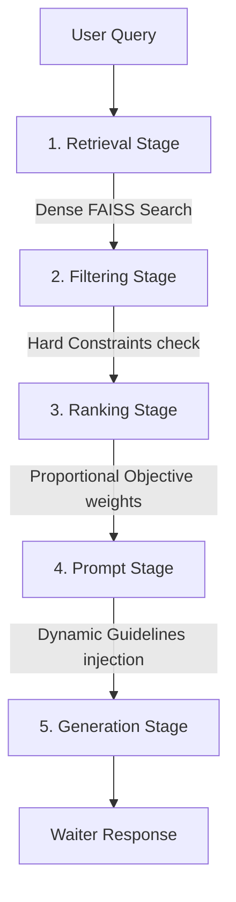

# DineAI Menu Intelligence Framework — Project Structure & Architecture

This document provides a comprehensive mapping of the DineAI project structure, detailing the directory layout, module purposes, architectural design patterns, and processing flows.

---

## 1. Directory Tree Visual

```text
d:\data\AI_WAITER\
├── PLANS/                                  # Architectural plans and walkthroughs
│   ├── project_structure.md                # [This File]
│   └── ...                                 # Walkthroughs and implementation plans
├── translations/                           # Translation catalogs for multi-lingual waiter persona
└── dine_ai/                                # Root Python package
    ├── app.py                              # Orchestration Facade & Pipeline Manager
    │
    ├── adapters/                           # Data Normalisation and Feature Engineering
    │   ├── __init__.py
    │   ├── schema_mapper.py                # Maps vendor CSV schemas to canonical forms
    │   ├── validator.py                    # Multi-tiered schema validation engine
    │   ├── feature_engineering.py          # Enriches datasets with dynamic nutritional & dietary flags
    │   └── text_builder.py                 # Constructs search chunks and RAG prompt texts
    │
    ├── capabilities/                       # Capability Registry & Detection Layer
    │   ├── __init__.py
    │   ├── base.py                         # Abstractions for capabilities & requirements
    │   ├── definitions.py                  # 24 concrete capability check implementations
    │   ├── registry.py                     # Service Locator registry for capabilities
    │   └── detector.py                     # Generates restaurant capability reports
    │
    ├── dataset/                            # Dataset Ingestion, Loading, and Building
    │   ├── __init__.py
    │   ├── loader.py                       # Reads and deserialises dataset binary artifacts
    │   ├── manager.py                      # Smart rebuild detector and lifecycle manager
    │   ├── metadata.py                     # Dataset Metadata schema & provenance tracker
    │   └── pipeline.py                     # Orchestrator sequencing all data builders
    │
    ├── datasets/                           # Storage for built restaurant database assets
    │   ├── restaurant_A/                   # Standard restaurant A built assets
    │   └── restaurant_deterministic/       # Test-specific deterministic catalog assets
    │
    ├── embeddings/                         # Vector Embedding Generation
    │   ├── __init__.py
    │   ├── embedding_builder.py            # Converts text chunks to dense vectors
    │   └── faiss_builder.py                # Builds and normalises FAISS indexes
    │
    ├── retrieval/                          # R-F-R (Retrieve, Filter, Rank) Stage Logic
    │   ├── __init__.py
    │   ├── semantic_search.py              # Query processor & FAISS search strategy
    │   ├── filtering.py                    # Multi-constraint hard & soft rules filter
    │   └── ranking.py                      # Multi-objective weighted ranker
    │
    ├── llm/                                # Generation & Prompt Engineering Stage
    │   ├── __init__.py
    │   ├── prompts.py                      # RAG template constructor & safety validator
    │   └── generator.py                    # LLM completion engine & client interface
    │
    ├── evaluation/                         # Evaluation routing proxies
    │   ├── __init__.py
    │   ├── end_to_end_test.py              # Proxy to evaluations/end_to_end_test.py
    │   └── integration_test.py             # Proxy to evaluations/integration_test.py
    │
    └── evaluations/                        # Comprehensive Test Suites & Verification
        ├── deterministic_scenarios_test.py # Deterministic recommendation test cases
        ├── integration_test.py             # Pipeline integration test suite
        └── end_to_end_test.py              # Chat query end-to-end evaluation suite
```

---

## 2. R-F-R (Retrieve-Filter-Rank) Architecture

DineAI is built on a modular, pipeline-based RAG architecture called **R-F-R** (Retrieval, Filtering, Ranking) that maps query context to targeted restaurant recommendations:



1. **Retrieval Stage**: Performs a semantic search against the pre-built FAISS index using normalized embeddings.
2. **Filtering Stage**: Applies structured filtering rules. Surpassable features are checked. If a filter requires a column that the current restaurant catalog is missing, the filter is skipped gracefully with a warning.
3. **Ranking Stage**: Scores candidates. If scoring features (e.g., rating or price) are missing, they are dynamically filtered out, and their weights are redistributed proportionally to maintain mathematical scoring consistency.
4. **Prompt Stage**: Prepares the RAG context. It reads the schema and appends strict instructions matching the restaurant's capabilities (e.g., preventing the LLM from hallucinating prices or ingredients that aren't in the dataset).
5. **Generation Stage**: Query and context are sent to the LLM completion engine to form the conversational Waiter response.

---

## 3. Detailed Module Breakdown & Purpose

### Core Facade & Orchestration
*   **[app.py](file:///d:/data/AI_WAITER/dine_ai/app.py)**
    *   **Purpose**: The main orchestrator for the entire DineAI framework. Contains the `DineAIApplication` facade, manages configuration states (`ApplicationConfig`, `ApplicationState`), defines R-F-R pipeline stages (e.g., `SemanticSearchStage`, `FilteringStage`), and formats trace debug reports.
    *   **Design Patterns**: Facade, Composite, Pipeline, Observer.

### Adapters (`dine_ai/adapters/`)
*   **[schema_mapper.py](file:///d:/data/AI_WAITER/dine_ai/adapters/schema_mapper.py)**
    *   **Purpose**: Fits and maps raw user-supplied CSV columns to the framework's canonical schema columns (e.g., mapping `product_name` to `recipe_name`).
*   **[validator.py](file:///d:/data/AI_WAITER/dine_ai/adapters/validator.py)**
    *   **Purpose**: Inspects dataframes post-mapping. Operates a 3-tier severity hierarchy (Mandatory fields fail validation; Recommended fields append non-blocking capability warnings; Optional fields are verified for type compliance).
*   **[feature_engineering.py](file:///d:/data/AI_WAITER/dine_ai/adapters/feature_engineering.py)**
    *   **Purpose**: Computes nutritional densities, price brackets, and dietary flags (`is_vegan`, `is_vegetarian`, etc.). Includes a fallback `ItemTypeEngineer` that auto-classifies items based on keywords in item names if the column is absent.
*   **[text_builder.py](file:///d:/data/AI_WAITER/dine_ai/adapters/text_builder.py)**
    *   **Purpose**: Merges structured attributes into raw text chunks (`search_text`, `text_chunk`, `summary_text`) to build the FAISS index and the LLM prompt.

### Capabilities (`dine_ai/capabilities/`)
*   **[base.py](file:///d:/data/AI_WAITER/dine_ai/capabilities/base.py)**
    *   **Purpose**: Defies `BaseCapability`, `CapabilityResult`, and requirement levels (`ColumnRequirement`).
*   **[definitions.py](file:///d:/data/AI_WAITER/dine_ai/capabilities/definitions.py)**
    *   **Purpose**: Implementation files for the 24 built-in capabilities (e.g. `VeganCapability`, `SaladCapability`, `BudgetRecommendationCapability`).
*   **[registry.py](file:///d:/data/AI_WAITER/dine_ai/capabilities/registry.py)**
    *   **Purpose**: Registry singleton maps capability definitions and queries them.
*   **[detector.py](file:///d:/data/AI_WAITER/dine_ai/capabilities/detector.py)**
    *   **Purpose**: Detects which of the 24 capabilities are met by a dataset and generates the `RestaurantCapabilityReport` containing the total capability score.

### Dataset Management (`dine_ai/dataset/`)
*   **[pipeline.py](file:///d:/data/AI_WAITER/dine_ai/dataset/pipeline.py)**
    *   **Purpose**: Sequences the ingestion pipeline: Read CSV $\rightarrow$ Map $\rightarrow$ Validate $\rightarrow$ Engineer Features $\rightarrow$ Build Text $\rightarrow$ Detect Capabilities $\rightarrow$ Generate Embeddings $\rightarrow$ Build FAISS $\rightarrow$ Save.
*   **[manager.py](file:///d:/data/AI_WAITER/dine_ai/dataset/manager.py)**
    *   **Purpose**: Controls the dataset rebuild cycle. Checks CSV hash changes and configuration modifications to initiate incremental or full builds automatically.
*   **[loader.py](file:///d:/data/AI_WAITER/dine_ai/dataset/loader.py)**
    *   **Purpose**: Deserialises the saved artifacts (`recipes.pkl`, `embeddings.npy`, `faiss.index`, `metadata.json`) into an immutable `RestaurantDataset`.
*   **[metadata.py](file:///d:/data/AI_WAITER/dine_ai/dataset/metadata.py)**
    *   **Purpose**: Defines the `DatasetMetadata` schema, capturing build times, framework versions, file hashes, and capability summaries.

### Embeddings (`dine_ai/embeddings/`)
*   **[embedding_builder.py](file:///d:/data/AI_WAITER/dine_ai/embeddings/embedding_builder.py)**
    *   **Purpose**: Client wrapper interfaces (e.g., SentenceTransformer, OpenAI, HuggingFace APIs) to convert text into vector outputs.
*   **[faiss_builder.py](file:///d:/data/AI_WAITER/dine_ai/embeddings/faiss_builder.py)**
    *   **Purpose**: Constructs and optimizes FAISS indices (FlatIP, IVF, HNSW) and packages them alongside document mapping records.

### Retrieval (`dine_ai/retrieval/`)
*   **[semantic_search.py](file:///d:/data/AI_WAITER/dine_ai/retrieval/semantic_search.py)**
    *   **Purpose**: Conducts semantic search queries against FAISS. Caches query vectors and supports custom score thresholding.
*   **[filtering.py](file:///d:/data/AI_WAITER/dine_ai/retrieval/filtering.py)**
    *   **Purpose**: Applies AND/OR nested rules. Dynamically skips rules that require missing columns to ensure capability-aware resilience.
*   **[ranking.py](file:///d:/data/AI_WAITER/dine_ai/retrieval/ranking.py)**
    *   **Purpose**: Multi-objective ranking engine. Dynamically scales factor weights when columns are absent.

### LLM & Prompts (`dine_ai/llm/`)
*   **[prompts.py](file:///d:/data/AI_WAITER/dine_ai/llm/prompts.py)**
    *   **Purpose**: Dynamically adjusts templates based on the metadata schema to prevent hallucination directives and trim rules mapping to missing columns.
*   **[generator.py](file:///d:/data/AI_WAITER/dine_ai/llm/generator.py)**
    *   **Purpose**: Handles RAG context payload completion requests. Supports offline stub mock models for local testing.

---

## 4. Subsystem Inter-Dependencies

```text
┌────────────────────────────────────────────────────────┐
│                      Application                       │
│                        (app.py)                        │
└───────────────────────────┬────────────────────────────┘
                            ▼
┌────────────────────────────────────────────────────────┐
│                     DatasetManager                     │
│                  (dataset/manager.py)                  │
└───────────────────────────┬────────────────────────────┘
                            ▼
┌────────────────────────────────────────────────────────┐
│                   RestaurantDataset                    │
│                  (dataset/loader.py)                   │
└───────────────────────────┬────────────────────────────┘
                            ▼
┌────────────────────────────────────────────────────────┐
│                   RestaurantManager                    │
│                        (app.py)                        │
└────────────────────────────────────────────────────────┘
```
This architecture preserves Single Responsibility (SRP): the `Application` facade queries the `DatasetManager` to get a loaded `RestaurantDataset` data container, which is then handed down to `RestaurantManager`. Business-level datasets are managed independently of the application facade orchestration layer.
